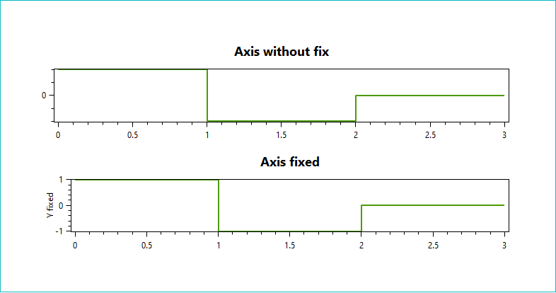

## oxyPolarDiagram
Demo how to display vectors in a polar plot

## OxyMouseDemo
Demo how to use mouse events to find closest points on a LineSeries:

## OxyAxisDemo
Demo how to change the axis to always show the "1" label.

